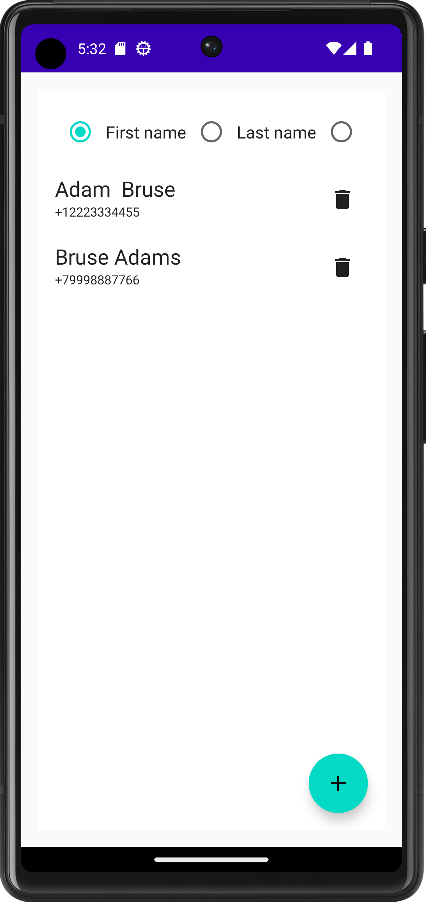

# ContactsApp
This is a simple Contacts App. I allows the user to add contacts and sort them by first name, last name or phone number. 

The project is written using: Room, MVVM, Kotlin Coroutines & Flow and Compose. 

# Demonstration

 
